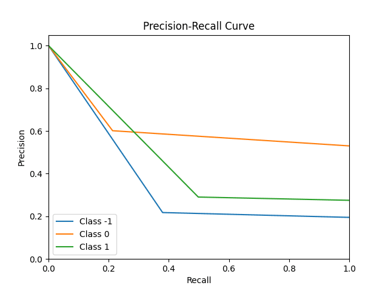
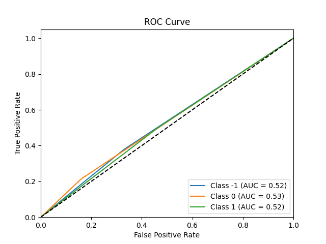
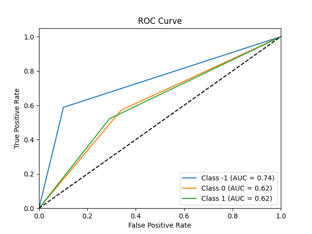
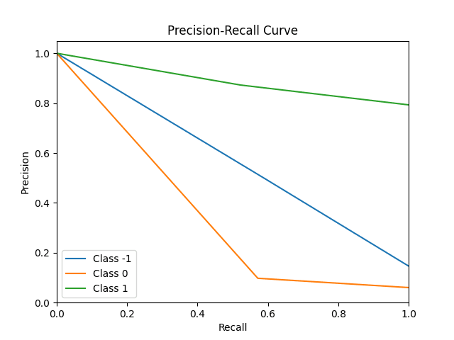

# SentiStrength 运行结果分析报告

### 运行情况

针对软工文本的 SE-Text 数据集、EM-Text 数据集，我们运行了 sentistrength 代码，对每条文本项给出三分类预测结果：1(积极)、0(中性)、-1(消极) ，并将其与原数据集中的人工标注结果进行比对。

### 数据处理

#### 数据来源

我们分别调查了当前主流的数据来源，找到了目前使用最多的情绪文本分析的数据库，并选择了[Recursive Deep Models for Semantic Compositionality Over a Sentiment Treebank ](https://nlp.stanford.edu/sentiment/index.html)数据作为情绪文本的来源。但是软工文本作为专业性较强的数据，并没有找到相对权威可靠的数据来源，于是我们选择通过 chatGPT 生成了一些文本，并通过人工和 chatGPT 综合的打分作为评判标准。

#### 处理结果

以人工标注结果为标准答案作为参照，分别计算了混淆矩阵、准确率、精度、召回率和 F1 分数，并画出了对应的 ROC 曲线和精确率 - 召回率曲线。具体结果如下：

```json
--------------- so-extension ---------------
confusion_mat:
	pos_real {'pos_pred': 48, 'neg_pred': 10, 'neu_pred': 34}
	neg_real {'pos_pred': 4, 'neg_pred': 10, 'neu_pred': 3}
	neu_real {'pos_pred': 3, 'neg_pred': 0, 'neu_pred': 4}
accuracy:	0.51786
precision:	{'pos': 0.87273, 'neg': 0.5, 'neu': 0.09756}
recall:		{'pos': 0.52174, 'neg': 0.58824, 'neu': 0.57143}
f1_score:	{'pos': 0.65306, 'neg': 0.54054, 'neu': 0.16667}

--------------- se-extension ---------------
confusion_mat:
	pos_real {'pos_pred': 137, 'neg_pred': 95, 'neu_pred': 43}
	neg_real {'pos_pred': 89, 'neg_pred': 74, 'neu_pred': 32}
	neu_real {'pos_pred': 246, 'neg_pred': 171, 'neu_pred': 113}
accuracy:	0.42517
precision:	{'pos': 0.29025, 'neg': 0.21765, 'neu': 0.60106}
recall:		{'pos': 0.49818, 'neg': 0.37949, 'neu': 0.21321}
f1_score:	{'pos': 0.3668, 'neg': 0.27664, 'neu': 0.31477}
```

其中，*pos* 表示 1(积极情绪)，*neg* 表示 -1(消极情绪)，*neu* 表示 0(中性情绪)

情绪文本分析结果：





软工文本分析结果：





### 结果分析

由数据分析结果可以看出，sentistrength 在软工文本数据集 so-extension 上的预测效果相对较好，在社交文本数据集上效果有些差。sentistrength 在给定的数据集上的预测表现与文本类型为软工文本或社交文本似乎出现了偏差，有着不同的表现。

- 在 se 即拓展情绪文本数据中，SentiStrength 对所有情绪的分析效果都非常差，但相对而言，SentiStrength 对积极文本的辨别正确率会高出一截，对中性情绪的判断较差。
- 在 so 即拓展软工文本中，SentiStrength 的预测准确性比 se 文本高很多，不管是积极文本、消极文本还是中性文本，预测率都要肉眼可见的高出一截

实际上，  由于选取文本的来源不同，文本的质量存在着极大的差距，从 StanfordTreeBank 的数据是从国外的媒体平台爬取的，一般来说会更贴近日常交流的口语化表达，同时也会参杂部分互联网词汇，可能具有隐晦的情绪倾向，但是 chatGPT 生成的软工文本的情绪指向非常明显，尤其是包括了一些明显情绪倾向的词汇，比如 very / so，更容易识别。

针对软工文本，我们将 sentistrength 预测错误的文本项提取出来进行了人工分析，得到如下可能的出错原因：

- 模型本身的缺陷

  - 对词语的意义不进行辨析，因此只靠对单纯词汇的分析和打分很难正确完整地打分，例如对存在 improve 的句子直接判别为积极。
  - SentiStrength 中用于进行情绪判定的单词实际上并不是代表某种绝对地价值倾向的，例如 SentiStrength 倾向于将 huge\ great 这样的词辨别为积极语义，忽视了 huge、great 可能是单纯用于修饰的形容词的情况，导致 Great error！Whta a huge mess！这样的词语也是积极情绪。
  - SentiStrength 无法理解具备多层情感趋向或者具备转折的语句。对于 SentiStrength，情绪是无法转折的，but 等连接词无法被识别。
  - 部分多义词语的使用会导致错误判断，例如 I'm afraid ... 就被识别为消极。
- 文本自身的缺陷

  - 在 StanfordTreebank 中的很多数据使用了非常用的口语化或者网络化词汇，导致 SentiStrength 无法识别，判定为中性。
- 软工文本的特殊之处
  - 实际上生成的大部分软工文本专业性不是很强，而且一般具有较强的情感趋向，相对容易识别。
  - 对软件系统 bug 的描述一般是消极趋向。
  - 有许多单用程度副词或短语表示消极情绪的场景。
  - 可能会有部分词汇包含了非该语境中的情感趋向，或者需要一定专业知识判断其情感。

### 概括总结

大多数情况下：

- 对于积极的情绪表达，社交文本更加明显，直接的情绪化词汇较多（大写字母、部分修饰词语），但是有相当一部分不常见的词汇，软工文本由于文本缺陷，反而更能表现出文本的情绪倾向。
- 对于消极的情绪表达，社交文本的表达形式更多样，更具生活气息，软工文本更具专业特色，而且常常与却显得处理相关。

社交文本中更多地使用缩写，也存在更多或故意或无意的拼写错误，情感表达更为随意、非正式和符号化，理论上来说会对基于词汇表的模型在情绪预测中造成更多的干扰，需要针对不规范的文字表达进行特殊的处理。

软工文本中更多地使用专业术语和具体的功能描述，语言使用相对工整规范，情感表达更为理性和客观，但软工术语可能会包含特定语境下特殊的情感倾向，需要针对其情感表达的特点进行特殊的处理。

无论是社交文本抑或是软工文本，当文本长度较长时，使用基于词汇表的算法可能难以准确把握文本中的情感倾向，出现“以偏概全”的现象，即以对个别单词的打分影响对整个文本情绪的判断。
